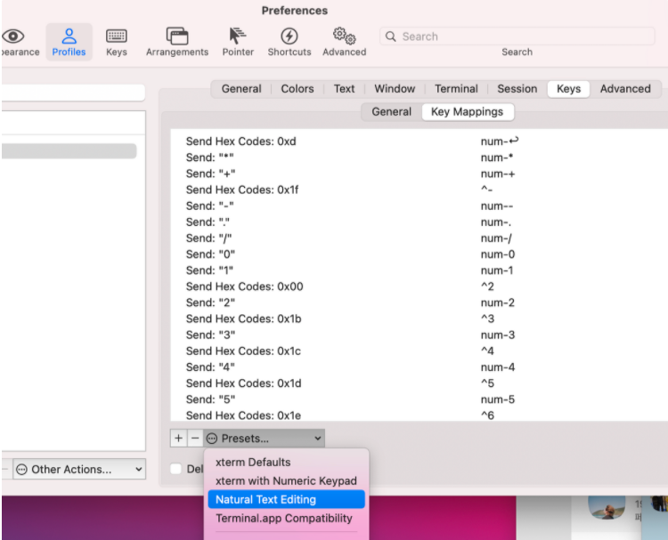

# ZSH Setup

## Going one word backwards and forwards

Then, you can

* move a word backwards Option ⌥ + ←
* move a word forwards Option ⌥ + →
* move to the start of the line fn + ←
* move to the end of the line fn + →
* delete a word backwards Option ⌥ + ⌫
* delete the whole line Command ⌘ + ⌫
